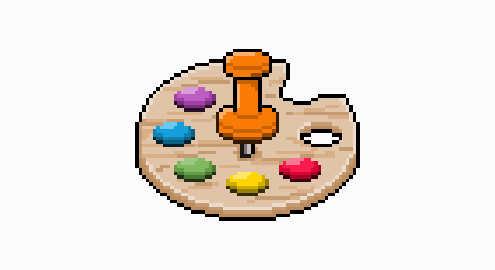
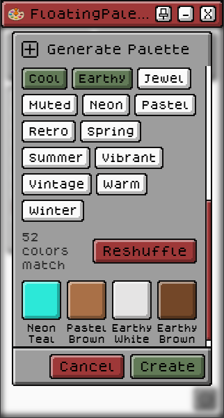
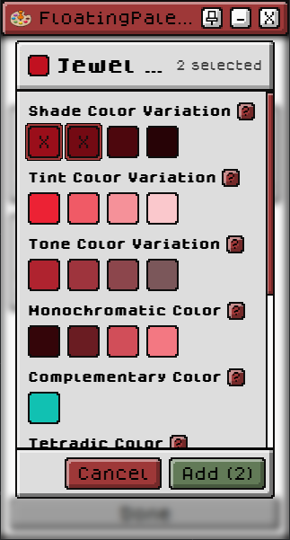
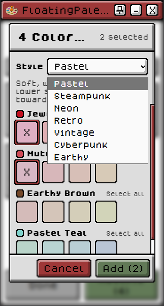
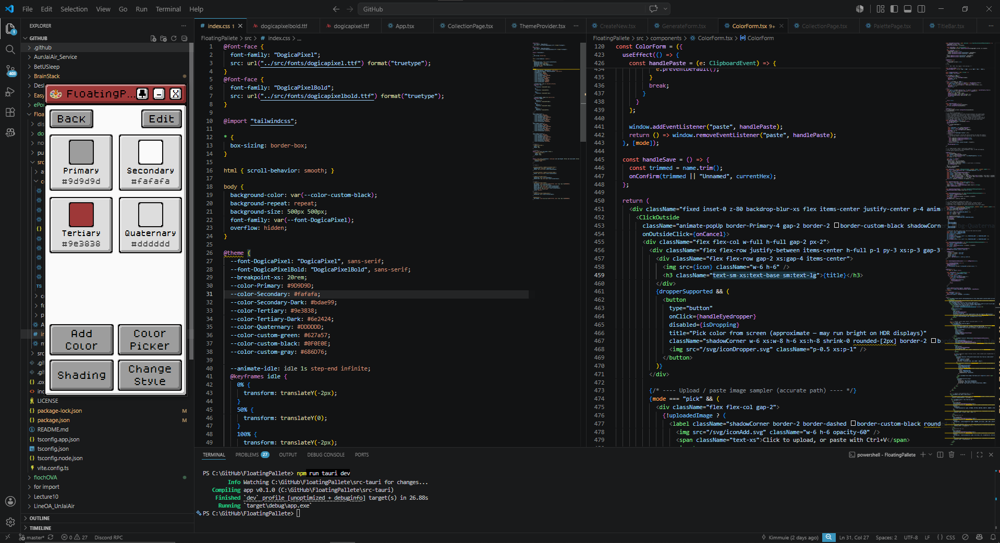
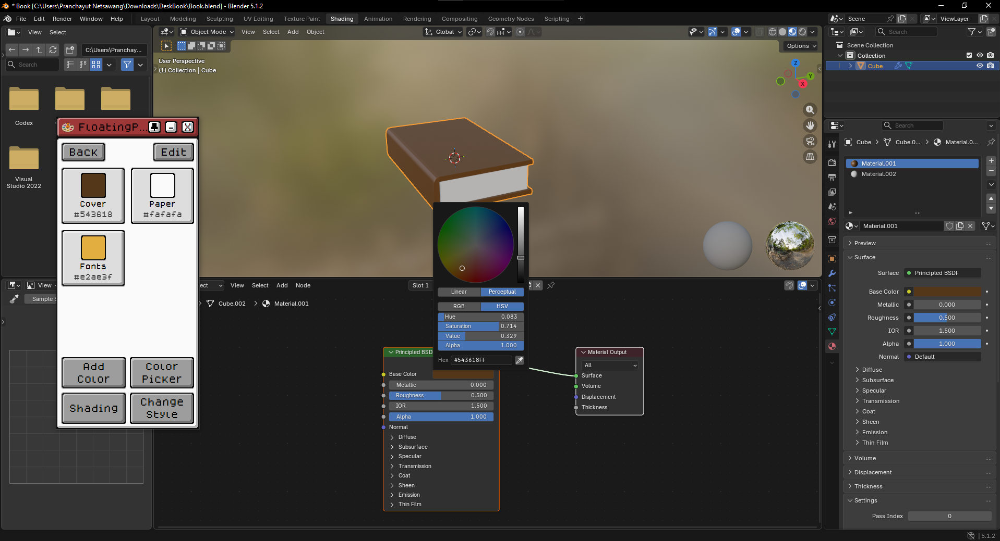

# 🎨 FloatingPalette

  

    
  

  
  
  

# ✨ Overview

FloatingPalette is a lightweight desktop utility built for designers, developers, pixel artists, UI/UX designers, and anyone who works with colors every day.

Instead of constantly switching between design software, browsers, or code editors just to grab a color, FloatingPalette keeps everything within reach. Pin your favorite palettes to your desktop, generate beautiful color schemes, extract colors from images or your screen, and instantly explore shades and alternative themes all from one lightweight application.

# 🚀 Features

| Feature | Description |
|---|---|
| **Palette Management** | Create palettes and organize your colors in one place. |
| **Palette Generator** | Generate beautiful color palettes in a few clicks. Choose from multiple colors and styles like Vibrant, Pastel, Warm, Earth Tone, and more. |
| **Color Extraction** | Pull palettes directly from pasted images or any color on your screen. |
| **Color Restyle** | Generate alternate color themes based on a selected palette to explore multiple design directions without manually adjusting every color. |
| **Color Shades** | Select any color and instantly generate variations like Shades, Tints, Tones, Monochromatic, Complementary, Tetradic, and more. |
| **Floating Desktop Palette** | Keep your colors accessible at all times and no more switching apps just to copy a color. |

## 📥 Download

### Microsoft Store (Recommended)

Install FloatingPalette directly from the Microsoft Store for automatic updates and a seamless installation experience.

> **Microsoft Store:** *(Coming Soon)*

### GitHub Releases

Download the latest installer from the Releases page.

https://github.com/Kimmuie/FloatingPalette/releases

# 🖥 Built With

  
  
# 📸 Screenshots

<table>
<tr>
<td align="center">

 <b>Palette Generator</b>
</td>

<td align="center">

 <b>Shading Colors</b>
</td>

<td align="center">

 <b>Restyle Colors</b>
</td>
</tr>
</table>

  

    
    
  

  
---

# 🤝 Contributing

Contributions, feature requests, and bug reports are always welcome.

If you have an idea that can improve FloatingPalette, feel free to open an issue or submit a pull request.

# ⭐ Support

If you enjoy FloatingPalette, consider giving this repository a ⭐.

It helps more people discover the project and supports future development.

# 📄 License

This project is licensed under the MIT License.

